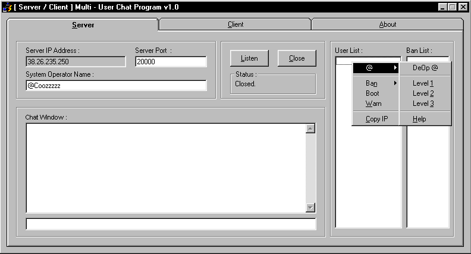



## Complete TCP Chat Program

### Description

Allows you to chat over the internet using the winsock control. Server functions include UserOpping to 3 levels, User Banning (ip & name), Booting, & Warning. Client functions include Boot & Warn (if opped to the right levels), File Sending, and you can play online tic-tac-toe. Additional features include Databasing of username & passwords, Duplicate name blocking, updated user list, and several irc-like commands such as /action (makes it look like you're doing something) /msg (send private messages to people) and /change (lets you change your username while connected. note : you might want to disable this to avoid problems) .
 
### More Info
 

             |
---                |---
**Submitted On**   |2000-05-06 02:19:58
**By**             |[coozzzzz](https://github.com/Planet-Source-Code/PSCIndex/blob/master/ByAuthor/coozzzzz.md)
**Level**          |Intermediate
**User Rating**    |4.7 (28 globes from 6 users)
**Compatibility**  |VB 5\.0, VB 6\.0
**Category**       |[Complete Applications](https://github.com/Planet-Source-Code/PSCIndex/blob/master/ByCategory/complete-applications__1-27.md)
**World**          |[Visual Basic](https://github.com/Planet-Source-Code/PSCIndex/blob/master/ByWorld/visual-basic.md)
**Archive File**   |[CODE\_UPLOAD5511552000\.zip](https://github.com/Planet-Source-Code/coozzzzz-complete-tcp-chat-program__1-7867/archive/master.zip)

